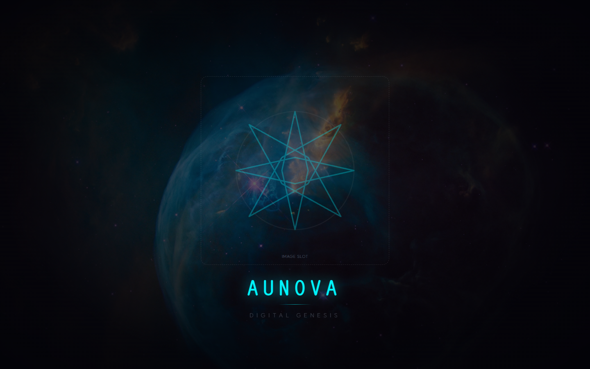
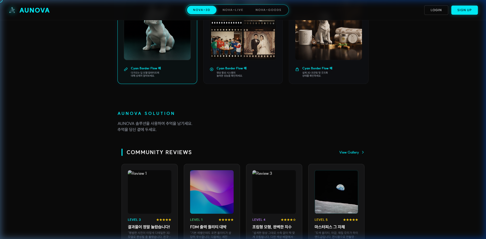
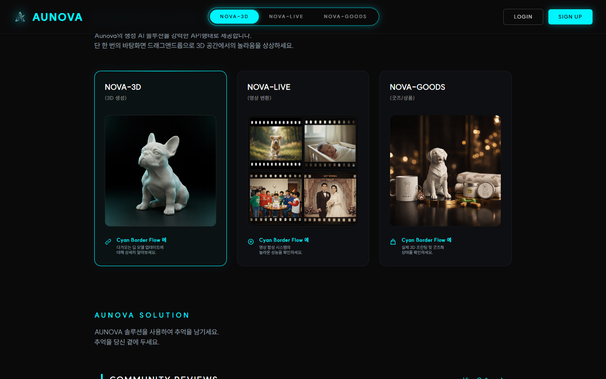
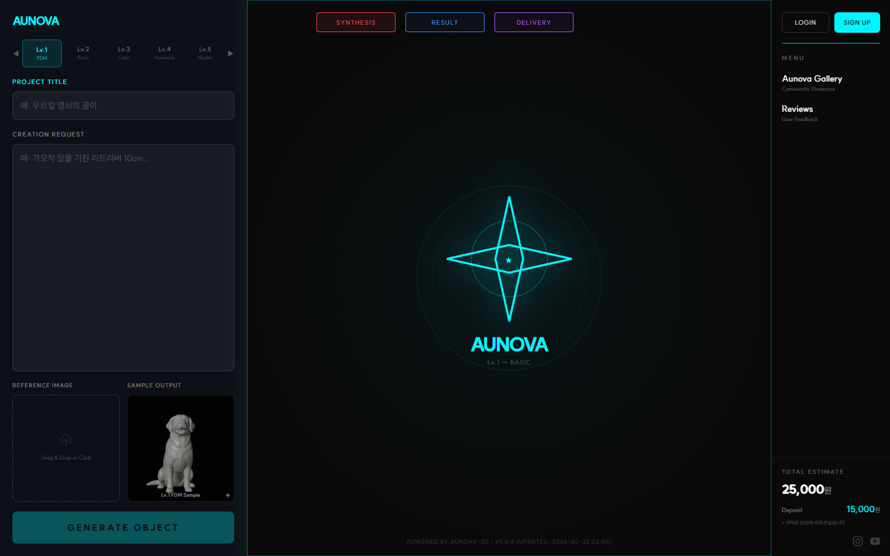
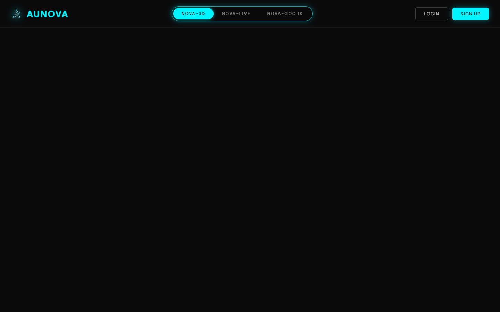
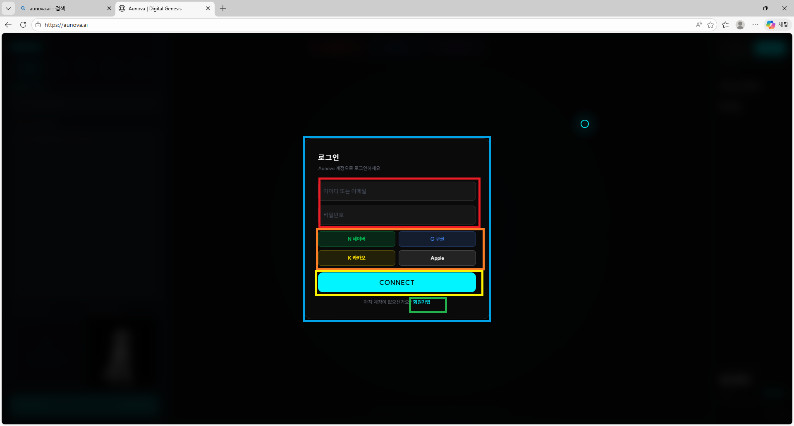
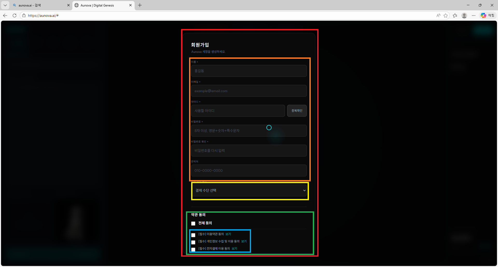
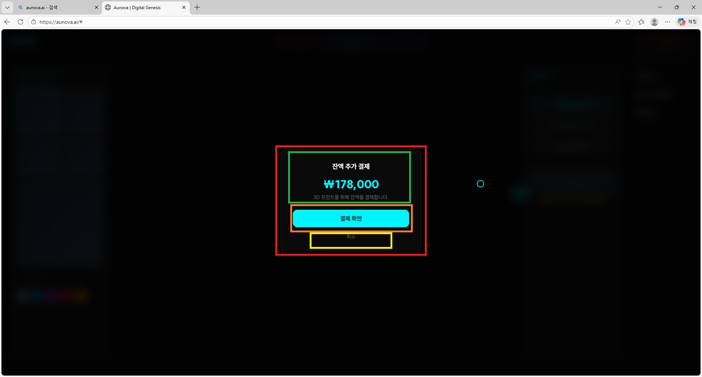
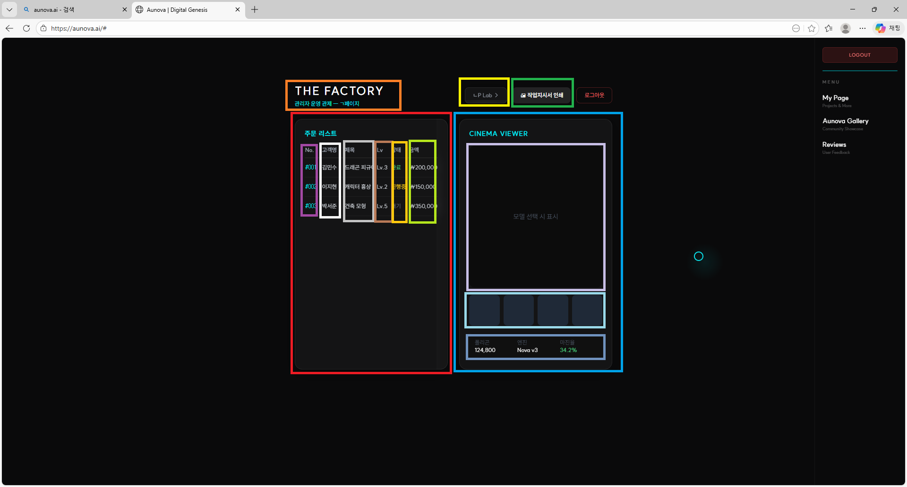
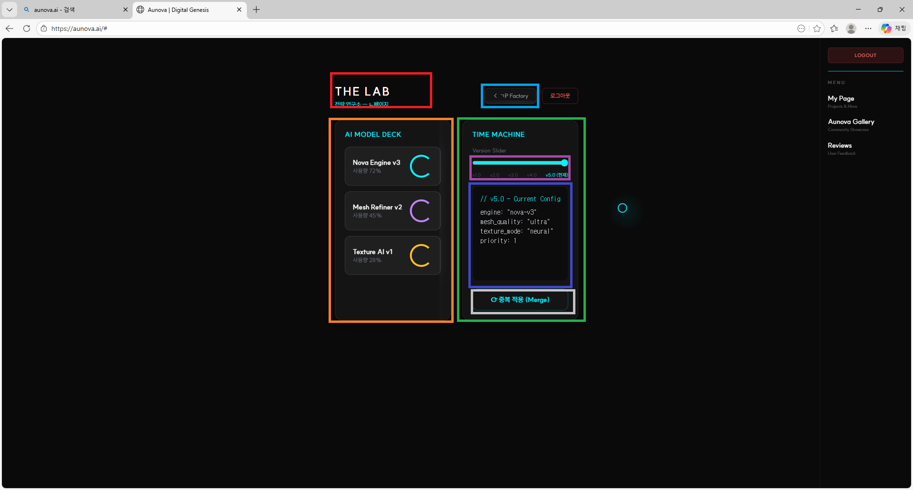

# AUNOVA Page Flow Definition

This document outlines the purpose, role, and visual representation of each page in the AUNOVA Digital Genesis platform, as updated by the user.

## 0 랜딩페이지 (Landing Page)

**페이지명 (Page Name):** 0 랜딩페이지 (Page 0)
**역할 (Role):**

- 플랫폼의 최초 진입점(Entry Point)입니다.
- 'AUNOVA DIGITAL GENESIS' 브랜딩을 노출하며 시각적이고 몰입감 있는 우주 배경 연출을 보여줍니다.
- 사용자 진입 시 클릭을 유도하는 인터랙티브 영역입니다.

**화면 영역 (UI Regions):**

- **[빨간색 영역]** 로고 이미지
- **[녹색 영역]** 로고명 및 설명

## 1 메인 랜딩 페이지 (Genesis Main Page)

**페이지명 (Page Name):** 1 메인 랜딩 페이지 (Page 1)
**역할 (Role):**

- 사이트 진입 후 가장 먼저 만나게 되는 대문 역할을 합니다.
- AUNOVA의 핵심 가치(사진을 3D로, 3D를 3D PRINTING으로)를 시각적으로 전달합니다.
- 사용자가 본격적인 3D 합성(Synthesis) 워크스페이스(2페이지)로 진입할 수 있도록 유도하는 'GENESIS' 메인 버튼을 제공합니다.
- 우측 상단 네비게이션을 통해 로그인/회원가입 모달창을 띄우거나 관리용 페이지(ㄱ, ㄴ)로 이동할 수 있는 진입점이기도 합니다.

**화면 영역 (UI Regions):**

- **[빨간색 영역]** 없음 (전체 배경 또는 여백 강조)
- **[주황색 영역]** 상단 AUNOVA 로고 위치
- **[노란색 영역]** 메인 카피라이트 타이틀 ('NOVA-3D:')
- **[초록색 텍스트 하일라이트 영역]** 서브 슬로건 강조 텍스트 ('3D', '3D PRINTING')
- **[파란색 텍스트 영역]** 상세 설명 서브 텍스트
- **[보라/분홍색 박스 영역]** GENESIS (2페이지 진입) 버튼
- **[하늘색 바텀 영역]** 우측 상단 네비게이션 (Gallery, Reviews 등)
- **[흰색 얇은 박스 영역]** 우측 로그인/회원가입 진입 버튼

---

## 1_1 메인 랜딩 페이지 중간 (Motion Synthesis)

**페이지명 (Page Name):** 1_1 메인 랜딩 페이지 (Motion Synthesis 영역)
**역할 (Role):**

- 1페이지에서 스크롤을 내렸을 때 보이는 서비스 소개 중간 영역입니다.
- '모션 합성 기술'에 대한 소개 텍스트 및 대표 홍보(시연) 영상을 재생하는 플레이어 뷰어가 자리합니다.
- 중앙에 영상/포트폴리오가 시각적으로 크게 자리잡아 기술력을 어필합니다.

**화면 영역 (UI Regions):**

- **[빨간색 영역]** 중앙 3D 비디오 재생 영역 (Motion Synthesis Video Player)

---

## 1_2 메인 랜딩 페이지 하단 (Footer)

**페이지명 (Page Name):** 1_2 메인 랜딩 페이지 (Footer 영역)
**역할 (Role):**

- 1페이지의 가장 아래쪽 푸터(Footer) 영역입니다.
- 회사 소개, 서비스 바로가기 링크, 이용약관 등 법적/회사 기본 정보와 연락처(Contact)가 구성되어 있습니다.

**화면 영역 (UI Regions):**

- **[주황색 영역]** 하단 AUNOVA 회사 정보, 서비스 바로가기 링크, 연락처(Contact) 종합 영역

---

## 2 Nova3D 의뢰서작성 (Synthesis Workspace)

**페이지명 (Page Name):** 2 Nova3D 의뢰서작성 (Page 2)
**역할 (Role):**

- 사용자가 실제로 3D 생성을 의뢰하고 작업하는 메인 워크스페이스(Workspace)입니다.
- 좌측 패널에서 Lv.1~Lv.5 난이도/품질 설정, 프로젝트 이름 입력, 생성 요청 사항(프롬프트) 작성 및 레퍼런스 이미지 업로드를 지원합니다.
- 상단의 진행 단계 네비게이션(SYNTHESIS 탭 활성화)과 중앙의 진행 애니메이션 뷰어, 그리고 우측의 예상 결제 금액 확인 창을 포함하는 가장 핵심적인 인터랙션 페이지입니다.

**화면 영역 (UI Regions):**

- **[빨간색 영역]** 로고 (AUNOVA)
- **[주황색 영역]** 난이도/품질(레벨) 설정 탭 (Lv.1 ~ Lv.5)
- **[노란색 영역(좌측)]** 프로젝트명 입력창
- **[녹색 영역(좌측)]** 생성 요청 사항 (프롬프트 텍스트) 입력창
- **[하늘색 영역(좌측)]** 레퍼런스 이미지 드롭존 영역
- **[파란색 영역]** 샘플 아웃풋 썸네일 확인창
- **[보라색/자주색 영역(좌측하단)]** 3D 오픈젝트 생성하기 (GENERATE OBJECT) 버튼
- **[분홍색 영역]** 상단 진행률 네비게이터 (SYNTHESIS / RESULT / DELIVERY)
- **[노란색 영역(우측상단)]** 로그인 / 회원가입 버튼
- **[연노란색 영역(우측)]** 네비게이션 메뉴 영역
- **[연두색 영역(우측하단)]** 총 결제 예상 금액 및 보증금 안내 패널
- **[하늘색 영역(우측최하단)]** 소셜 미디어 아이콘 등 푸터 영역

## c 보증금 결제 페이지 (Deposit Payment Modal)

**페이지명 (Page Name):** c 보증금 결제 (Deposit Payment Modal)
**역할 (Role):**

- 2페이지 3D 생성 의뢰 버튼 클릭 시 나타나는 선결제 확인용 모달입니다.
- 총 금액 중 작업 시작을 위한 임시 보증금 결제를 요청합니다.

**화면 영역 (UI Regions):**

- **[빨간색 영역]** 없음 (모달창 전체)
- **[노란색 영역]** 경고/알림 아이콘 (결제 확인)
- **[파란색 텍스트 영역]** 총 금액 및 우선 결제(보증금) 금액 표기
- **[자주색 버튼 영역(좌)]** 돌아가기 (Cancel) 버튼
- **[하늘색 버튼 영역(우)]** 결제 및 생성 (Confirm & Pay) 버튼

---

## 3 Nova3D 생성대기 페이지 (Processing Wait Page)

**페이지명 (Page Name):** 3 Nova3D 생성대기 페이지 (Page 3)
**역할 (Role):**

- 앞선 의뢰서 작성 및 보증금 결제 완료 후, AI가 3D 모델을 실제로 생성하는 동안 표시되는 대기(Loading) 화면입니다.
- 중앙에 AUNOVA 고유의 반짝이는 별 애니메이션과 함께 사용자가 입력한 작품명이 '탄생하고 있습니다...'라는 동적인 타이핑 텍스트 효과로 표시되어 지루함을 덜어줍니다.
- 일정 시간 로딩이 완료되면 다음 단계(결과 뷰어)로 넘어갈 수 있는 'NEXT' 버튼이 활성화되는 트랜지션 역할의 페이지입니다.

**화면 영역 (UI Regions):**

- **[초록색 영역]** 좌측 상단 로고 (AUNOVA)
- **[하늘색 영역]** 우측 상단 로그인 / 회원가입 버튼
- **[보라색 영역]** 우측 사이드 네비게이션 메뉴 (Aunova Gallery, Reviews)
- **[빨간색 영역]** 중앙 3D 진행 애니메이션 뷰어 (인터랙티브 별 심볼)
- **[주황색 영역]** 현재 진행 상태 표시 텍스트창 ('탄생하고 있습니다...', '잠시만 기다려 주세요...')
- **[노란색 영역]** 다음 단계(NEXT) 이동 버튼

---

## 4 Nova3D 결과 선택 페이지 (Result Viewer & Export)

**페이지명 (Page Name):** 4 Nova3D 결과 선택 페이지 (Page 4)
**역할 (Role):**

- 생성 완료된 3D 모델(결과물)을 확인하고 스타일을 변경하거나, 파일을 외부로 내보내는(Export) 최종결과 확인 페이지입니다.
- 좌측 패널(STYLE SELECT)에서는 A~E 스타일 옵션 및 컬러 팔레트로 재질/색상을 실시간 변경할 수 있습니다.
- 중앙 뷰어를 통해 결과물을 3D 캔버스 공간에서 돌려가며 자세하게 확인(RESULT 탭 활성화)할 수 있습니다.
- 우측 패널(EXPORT)에서는 생성된 데이터를 다운로드(STL, OBJ, PLY)하거나 3D Print 요청을 추가 결제 금액과 함께 진행할 수 있습니다.

**화면 영역 (UI Regions):**

- **[살구색 영역]** 좌측 상단 로고 (AUNOVA)
- **[빨간색 영역]** 좌측 스타일 선택 패널 (STYLE SELECT - A, B, C, D, E)
- **[주황색 영역]** 좌측 하단 컬러 팔레트 패널 (COLOR PALETTE)
- **[보라색 영역]** 상단 진행 단계 네비게이터 (SYNTHESIS / RESULT / DELIVERY)
- **[파란색 영역]** 중앙 3D 모델 뷰어 영역 (3D Model Viewer)
- **[노란색 영역]** 우측 상단 파일 추출 메뉴 (EXPORT - Download STL, OBJ, PLY)
- **[초록색 영역]** 우측 하단 3D Print 요청 영역 (금액 안내 및 결제 버튼)

---

## 5 Nova3D 3D printing 요청완료 페이지 (Delivery & Home)

**페이지명 (Page Name):** 5 Nova3D 3D printing 요청완료 페이지 (Page 5)
**역할 (Role):**

- 앞선 4페이지에서 '3D Print 요청'을 결제/승인한 뒤 전환되는 모의 배송 안내 화면(Delivery)입니다.
- 반짝이는 별 애니메이션과 함께 '[작품명]이(가) 집으로 가고 있습니다...'라는 메시지와 '안전하게 배송해 드리겠습니다...'라는 따뜻한 텍스트를 제공하여 결제 후 안도감과 기대감을 줍니다.
- 상단 네비게이션은 최종 'DELIVERY' 단계가 활성화되며, 중앙의 'HOME' 버튼을 통해 다시 1페이지(메인 앱 화면)로 자연스럽게 복귀하는 순환 구조를 마무리지어 줍니다.

**화면 영역 (UI Regions):**

- **[빨간색 영역]** 좌측 상단 로고 (AUNOVA)
- **[주황색 영역]** 상단 진행 완료 단계 네비게이터 (SYNTHESIS / RESULT / DELIVERY)
- **[노란색 영역]** 중앙 3D 진행 애니메이션 뷰어 (인터랙티브 별 심볼)
- **[초록색 영역]** 배송 완료 및 마무리 안내 텍스트창 ('집으로 가고 있습니다...', '안전하게 배송해 드리겠습니다...')
- **[하늘색 영역]** 중앙 하단 HOME (메인화면 복귀) 버튼

## a 로그인 페이지 (Login Page / Modal)

**페이지명 (Page Name):** a 로그인 페이지 (Login Modal)
**역할 (Role):**

- 플랫폼 내의 개인화된 서비스(2페이지 워크스페이스 등)에 접근하기 전, 사용자 인증을 거치는 로그인 창입니다.
- 단독 페이지라기보다는 다른 페이지(주로 1페이지 메인) 위에 겹쳐서 뜨는 모달(Modal) 형태로 구현되어 화면 전환의 이질감을 줄입니다.
- 이메일/비밀번호 기본 로그인 외에도 네이버, 구글, 카카오, 애플 등 다양한 소셜 로그인(SNS) 버튼을 제공하여 사용자 접근성을 높인 것이 특징입니다.

**화면 영역 (UI Regions):**

- **[하늘색 영역]** 로그인 창 전체 모달 및 상단 안내 영역
- **[빨간색 영역]** 아이디(또는 이메일) 및 비밀번호 입력 폼
- **[주황색 영역]** SNS 간편 로그인 옵션 버튼들 (네이버, 구글, 카카오, Apple)
- **[노란색 영역]** 하단 'CONNECT' (로그인 실행) 메인 버튼
- **[초록색 영역]** 최하단 '회원가입' 텍스트 이동 링크

## b 회원가입 페이지 (Signup Page / Modal)

**페이지명 (Page Name):** b 회원가입 페이지 (Signup Modal)
**역할 (Role):**

- AUNOVA 플랫폼의 신규 계정을 생성하는 모달 기반의 진입점입니다.
- 사용자 이름, 이메일, 아이디(중복확인 지원), 비밀번호, 연락처, 결제 수단 등록 등 상세한 회원 정보를 기입받는 구조로 설계되었습니다.
- 서비스 이용약관, 개인정보 수집 등 필수/선택 약관 동의 체크박스를 포함하여 정식 서비스 제공을 위한 법적, 행정적 절차를 완료하게 해줍니다.

**화면 영역 (UI Regions):**

- **[빨간색 영역]** 회원가입 모달 전체창 및 타이틀 영역
- **[주황색 영역]** 기본 인적사항 입력 필드 (이름, 이메일, 아이디, 비밀번호, 연락처 등)
- **[하늘색 영역(작은원)]** 비밀번호 조건 안내 툴팁/아이콘
- **[노란색 영역]** 결제 수단 선택 드롭다운 영역
- **[초록색 영역]** 외부 약관 동의 체크박스 및 전문 보기 링크 모음 패널
- **[파란색 영역]** 개별 필수 약관 '보기' 링크 텍스트

## c Nova3D 보증금 결제 페이지 (Deposit Payment Page / Modal)

**페이지명 (Page Name):** c Nova3D 보증금 결제 페이지 (Deposit Payment Modal)
**역할 (Role):**

- 2페이지 워크스페이스에서 3D 모델 '생성(SYNTHESIS)' 버튼을 눌렀을 때 나타나는 중간 결제 승인 단계입니다.
- 전액 결제가 아닌 '보증금(우선 결제)' 개념을 소비자에게 명확히 안내하며 결제 승인을 확인받습니다.
- API 호출 등 뒷단 서버 연동을 위한 필수 확인 절차이며, '결제 및 생성' 클릭 시 대기/처리 화면(3페이지) 거쳐 결과 화면(4페이지)으로 사용자 플로우를 안전하게 이어줍니다.

**화면 영역 (UI Regions):**

- **[빨간색 영역]** 보증금 결제 경고/안내 모달 전체창 영역
- **[주황색 영역]** 결제 금액 상세 정보 (총 금액, 보증금 우선 결제 안내) 패널
- **[노란색 영역]** 이전 단계로 돌아가기 (Cancel/Back) 버튼
- **[초록색 영역]** 결제 및 3D 모델 생성 진행 (Confirm & Pay) 버튼

## d Nova3D 최종 결제 페이지 (Final Payment Page / Modal)

**페이지명 (Page Name):** d Nova3D 최종 결제 페이지 (Final Payment Modal)
**역할 (Role):**

- 앞선 4페이지(결과 선택 및 Export)에서 최종 결과물 확인 후 '3D Print 요청' 버튼을 클릭했을 때 나타나는 안내 모달입니다.
- 3D 프린트를 진행하기 위해 앞서 지불한 보증금을 제외한 '잔액(예: ₩178,000)'을 최종적으로 결제 요청하는 단계입니다.
- '결제 확인' 클릭 시 인증 및 승인 절차를 거쳐 마지막 배송 단계(5페이지)로 흐름을 이어가며, AUNOVA 플랫폼 내에서의 상거래 사이클을 완성합니다.

**화면 영역 (UI Regions):**

- **[빨간색 영역]** 최종 잔액 추가 결제 모달 전체창 영역
- **[초록색 영역]** 결제 금액 상세 정보 (잔액 추가 결제 타이틀 및 총 결제 필요 금액) 패널
- **[주황색/하늘색 영역]** 결제 승인 및 진행 (결제 확인) 메인 버튼
- **[노란색 영역]** 취소 및 모달 닫기 (이전으로) 텍스트 버튼

## ㄱ factory 페이지 (Admin Factory Page)

**페이지명 (Page Name):** ㄱ factory 페이지 (Admin Factory Page)
**역할 (Role):**

- AUNOVA 서비스 관리자(운영자)가 고객들의 3D 주문/의뢰 내역을 확인하고 관리하는 후방 운영(Back-office) 페이지입니다.
- '주문 리스트' 패널을 통해 고객명, 작품 제목, 난이도(Lv), 진행 상태(완료/진행중/대기), 결제 금액 등의 의뢰 접수 및 진행 현황을 한눈에 파악할 수 있습니다.
- 우측의 'CINEMA VIEWER' 영역에서는 특정 주문을 선택하여 결과 모델을 검토할 수 있으며, 상단의 '작업지시서 인쇄' 및 'L-P Lab' 연동 버튼을 통해 실제 3D 프린팅 공정으로 작업을 전달하는 허브 역할을 수행합니다.

**화면 영역 (UI Regions):**

**상단 공통 라인**

- **[주황색 영역]** 관리자 첫 화면 메인 타이틀 (THE FACTORY) 및 페이지 구분 안내
- **[노란색 영역]** 또 다른 관리자 페이지인 'ㄴ P Lab' 으로 이동하는 전환 링크 버튼
- **[초록색 영역]** 주문 내역 기반 작업지시서 인쇄(프린트) 기능 버튼

**좌측 패널 (주문 리스트)**

- **[빨간색 영역]** 좌측 전역 - 접수된 전체 '주문 리스트' 현황판 패널
- **[보라색 테두리 영역]** 주문 번호 (No.) 컬럼
- **[흰색 테두리 영역]** 고객명 (Customer) 컬럼
- **[살구색 테두리 영역]** 의뢰 작품 제목 (Title) 컬럼
- **[구리색/안개색 테두리 영역]** 선택된 난이도 레벨 (Lv) 컬럼
- **[연두색 테두리 영역]** 현재 작업 상태 (진행중, 완료, 대기) 컬럼
- **[연노란색 테두리 영역]** 총 결제 금액 표기 컬럼

**우측 패널 (CINEMA VIEWER)**

- **[파란색 영역]** 우측 전역 - 'CINEMA VIEWER' (3D 모델 검토 뷰어) 통합 패널
- **[연보라색 테두리 영역]** 메인 3D 모델 표시 캔버스 (모델 렌더링 영역)
- **[하늘색 테두리 영역]** 세부 모델 뷰 제어/관련 옵션 인터페이스 (썸네일 혹은 툴바) 하단 영역

## ㄴ lab 페이지 (Admin Lab Page)

**페이지명 (Page Name):** ㄴ lab 페이지 (Admin Lab Page)
**역할 (Role):**

- AUNOVA AI 기술 및 모델의 핵심 성능을 관리/조정하는 시스템 관리자(엔지니어링) 레벨의 심화 대시보드입니다.
- 좌측 'AI MODEL DECK' 패널에서 각 모델별 활성 API 종류 확인 및 현재 사용량 모니터링, 그리고 시스템 한계치에 따른 사용률(할당량) 변경 및 조정을 실시간으로 관리할 수 있습니다.
- 우측 'TIME MACHINE' 패널에서는 AI 과정 성공 및 실패율을 분석하고, 적용 중인 프롬프트와 버전/파라미터를 통제할 뿐 아니라 새로운 학습 내용(Merge)의 추가 및 제거를 실시간으로 통제하는 테스트/서버 릴리즈 통제실 역할을 수행합니다.

**화면 영역 (UI Regions):**

- **[빨간색 영역]** 관리자 랩 메인 타이틀 (THE LAB)
- **[파란색 영역]** 이전 화면(ㄱ P Factory)으로 돌아가기 버튼
- **[주황색 영역]** 좌측 전역 - 'AI MODEL DECK' (AI 모델별 사용량 및 API 현황 모니터링) 패널
- **[초록색 영역]** 우측 전역 - 'TIME MACHINE' (AI 모델 상세 통제, 버전 롤백/업데이트 등) 패널
- **[보라색 영역]** 타임머신 패널 내 'Version Slider' (AI 모델 버전 선택 슬라이더 컨트롤)
- **[남색 영역]** 타임머신 패널 내 현재 버전 설정(Config/Parameter) 코드/텍스트 뷰 영역
- **[회색 영역]** 중복 적용 (Merge) 기능 실행 버튼
